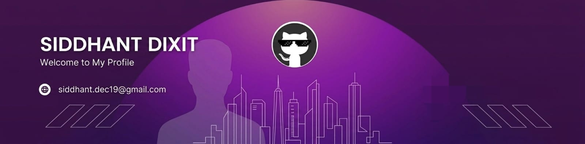

<!--Banner-->

<!--Night Owl image-->

  

<!--Header Name-->
#  ɪ'ᴍ Sid! 
*Digital Craftsman (Developer / Programmer)*
  
  
<!--Profile Count Badge-->

  

# 💫 About Me:
Hey everyone! It's Sid here.
I’m a tech enthusiast driven by curiosity and a passion for how innovation shapes the world. I'm actively learning and exploring technology, coding, and modern problem-solving while staying tuned to emerging trends, startups, and breakthrough ideas. I follow entrepreneurs, tech leaders, and the business world closely to understand how vision turns into real-world impact.

I believe in learning by doing—maybe I lack some skills today, but trust me, I’m a fast learner. I adapt quickly, experiment boldly, and grow through hands-on experience rather than just theory.

From exploring software to understanding digital ecosystems, I’m building a foundation that blends technical skills with strategic thinking. As I grow, I aim to contribute to tech-driven projects that create meaningful change while expanding my knowledge, network, and expertise.

Let’s connect and build something impactful together.

<!-- Snake Game Repo View -->

  

## 🌐 Socials:
   

# 💻 Tech Stack:
           
<!-- Proudly created with GPRM ( https://gprm.itsvg.in ) -->

<!--
**isiddhantdixit/isiddhantdixit** is a ✨ _special_ ✨ repository because its `README.md` (this file) appears on your GitHub profile.

Here are some ideas to get you started:

- 🔭 I’m currently working on ...
- 🌱 I’m currently learning ...
- 👯 I’m looking to collaborate on ...
- 🤔 I’m looking for help with ...
- 💬 Ask me about ...
- 📫 How to reach me: ...
- 😄 Pronouns: ...
- ⚡ Fun fact: ...
-->
